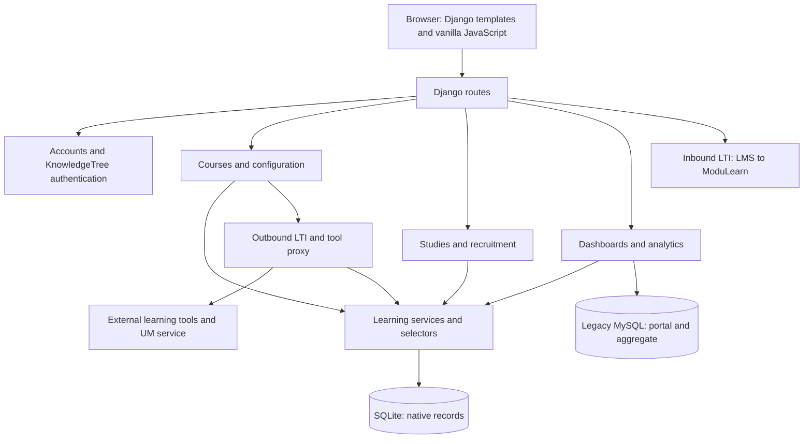

# Repository review and maintenance handoff

Reviewed 2026-09-24 against commit `3db42ee` and the existing working tree. This is a source-and-local-runtime review, not a certification of the deployed service. No application behavior was changed during the review.

## Scope and evidence

The baseline inventory contains **260 project files**, approximately **2.50 MB** and **55,522 text lines**: 145 Python files, 57 HTML templates, 24 Markdown documents, 11 JavaScript files, four CSS files, and supporting configuration/data/assets. It includes 39 migration files and 182 test methods. The [file map](repository-file-map.md) identifies every baseline file and its structural contents. Counts predate this report and the file map.

The examination covered the application packages, internal services and selectors, URL routing, models and migrations, authentication, integration adapters, proxy transformations, templates and scripts, deployment files, documentation, tests, and local storage layout. All Python files were parsed; critical execution paths were read and traced across layers. Generated/dependency directories were inventoried by purpose rather than reviewed as original application code. Key and environment-file values are deliberately omitted.

Existing changes in five documentation files and three untracked documentation files were preserved. Review-generated environments, logs, synthetic databases, and scripts reside in ignored local directories; they are not application deliverables or new runtime dependencies. The temporary review web server was stopped afterward.

Evidence terminology below:

- **Reproduced:** observed with synthetic records in a disposable database, without external service calls.
- **Source-confirmed:** directly follows from implementation; no live exploitation or production request was attempted.
- **Needs runtime validation:** a concern whose impact depends on deployment, provider behavior, concurrency, or browser behavior.

## What the application is

ModuLearn is a server-rendered Django learning platform with three closely connected workloads: native courses and instructor administration; delivery and tracking of external learning tools; and research studies with participant recruitment, condition assignment, forms, and analytics. Legacy KnowledgeTree/MasteryGrids infrastructure remains a substantial dependency, alongside newer native learning records.

The six Django apps are `accounts`, `courses`, `dashboard`, `lti`, `main`, and `recruitment`. The project package `modulearn` also owns outbound LTI and the tool proxy. Its `core`, `learning`, and `integrations` packages provide reusable behavior. The architecture is partly extracted into services, but major controllers and templates remain large: `courses/views.py` is about 2,916 lines, `views_proxy.py` 2,119, and the course configuration template 5,184. Future changes should trace both the service and its callers; the views are not uniformly thin.

### Route ownership

| Prefix | Responsibility | Main entry point |
|---|---|---|
| `/accounts/` | Local/KT login, signup, profiles, password flows | `accounts/urls.py`, `accounts/views.py` |
| `/courses/` | Course/session management, configuration, enrollment, launches, progress, forms | `courses/urls.py`, `courses/views.py` |
| `/dashboard/` | Native and legacy dashboards, histories, data endpoints | `dashboard/urls.py`, `dashboard/views.py` |
| `/r/` | Studies, recruitment sources, participant entry/completion | `recruitment/urls.py`, `recruitment/views.py` |
| `/lti/launch/` and related setup/OIDC URLs | ModuLearn as an LMS tool | `lti/views.py`, `lti/platforms.py` |
| `/lti/tool-launch/`, `/lti/outcome/` | ModuLearn launching another tool and receiving results | `modulearn/views_lti.py` |
| `/proxy/`, `/pcex/`, `/cbum/`, ACOS compatibility paths | Tool content/API rewriting and tracking | `modulearn/views_proxy.py` |
| `/`, `/admin/`, `/i18n/` | Public pages, Django admin, language selection | Root URL configuration |

Production can mount all application routes below `/modulearn`. Resolve URLs with Django and the existing prefix helpers; hard-coded root-relative URLs can bypass that prefix.

## Data model and invariants

### Identity and authorization

`accounts.User` extends Django's user model. Instructor/student flags, staff status, KT identity/groups, Canvas identity, and anonymous-research status have distinct meanings. Instructor status suppresses student status in model normalization. Some paths use the central role snapshot while others read flags directly. Locally registered users can choose instructor status, so instructor-only checks do not establish ownership of a particular course.

Emails are stripped and case-folded, with a conditional case-insensitive uniqueness constraint for nonempty addresses. Prefer the shared email lookup/normalization helpers. Anonymous research participants use unusable passwords and must not be confused with instructor-generated anonymous classroom rosters.

KT authentication is local-first with remote fallback. Existing local roles are preserved. New KT users derive instructor status from the legacy non-student lookup; an unavailable lookup does not automatically make them instructors. API authentication, database authentication, optional account provisioning, the Course Authoring `x-login` credential, and the KT browser session are separate mechanisms.

### Course structure versus delivery session

| Entity | Meaning and maintenance constraint |
|---|---|
| `Course` | Reusable content structure; string identifier; shared instructor relationships and plugin configuration. |
| `CourseInstance` | A delivery offering, called a session in the UI; group name, active state, instructors, and enrollments. Course plus group name is unique. |
| `Unit` | Ordered content grouping on the Course, with visibility, locking, and JSON unlock rules. |
| `Module` | Ordered activity on a Unit. Current types: imported, external link, SPLICE smart content, file, form. |
| `Enrollment` | Student participation in one CourseInstance; student/session pair is unique. |
| `ModuleProgress` | Activity state tied to the learner, module, and enrollment; includes provider state, attempts, timestamps, and research context. |
| `CourseProgress` | Stored enrollment-level aggregate; must be recomputed when its inputs change. |
| `ModuleProgressEvent` | Durable learning/result/session-event history with snapshot values and raw payloads. |
| `ModuleAccessLog` | Separate view/launch/download/form access ledger used by access conditions. |
| Form/question/submission/answer models | Native questionnaires and study steps attached to modules. |
| Branch rule/unlock models | Conditional edges and persistent per-enrollment unlock decisions. |

The central distinction: a configuration URL identifies a **CourseInstance**, but most content edits change its shared **Course**. Editing a unit, module, form, or plugin can affect every session using that course. Session ownership and course ownership need deliberate handling at every mutating endpoint.

Enrollment creation initializes course and module progress through signals. Later additions must synchronize existing enrollments. The custom-module path does this and recomputes aggregates; generic structure changes do not consistently maintain the same invariants.

Imports accept both modern exports and legacy Course Authoring data. Modern portable exports include forms, embedded files, branching and remappable unlock rules; they can clone to a new course identity. Legacy merge behavior matches course IDs and unit/module titles. It is not a simple append operation and is not protected by one encompassing transaction. Research locking is intended to freeze protocols after participation begins, but every alternate import/edit path must enforce it.

### Progress, access, and adaptive behavior

[`apply_progress_snapshot`](../modulearn/learning/services/progress.py) is the central write path. Module progress uses **0–1**, module scores use **0–100**, and course progress uses **0–100**. It clamps values, updates completion/success state, preserves the first completion timestamp, writes events, recomputes the enrollment aggregate, and applies branching. Attempts are handled by callers and need separate attention when adding a provider.

Course aggregates include every visible module in a visible unit, including locked modules. Missing progress and missing scores contribute zero. A first completion timestamp can survive subsequent regression or reopening. Consequently a historical completion timestamp and current complete state answer different questions. External grade passback may occur synchronously inside the progress transaction, increasing transaction duration if a provider is slow.

Access evaluation combines visibility, unit/module static rules, access/completion records, study condition, and dynamic branch unlocks. Dynamic unlocks can bypass a visible locked parent unit; they do not make hidden content visible.

The guided-sequence plugin performs a configuration transformation on enable, setting visibility and predecessor requirements. Adaptive branching supports success, failure with score evidence, completion, and score thresholds, optionally restricted by study condition. Matching rules are ordered, but all matching rules can fire; they are not an exclusive first-match switch. Unlocks persist per enrollment.

Static and dynamic recommendation plugins are registered configuration capabilities, not complete recommendation engines. The removed MasteryGrids-style plugin still has residual selector/template branches. Do not infer functionality from a plugin label alone.

Native form types are Likert, single choice, multiple choice, short answer, and long answer. Successful submission currently marks completion with a score of 100; this is not a correctness-based quiz evaluator. Validation focuses on required presence rather than a comprehensive option/answer schema. Legacy consent/pretest/task/posttest module types are migrated to forms with a `study_step` in content data.

### Research domain

`Study` owns a single backing CourseInstance, its instructors and ordered `StudyCondition` records. Default study creation provisions Consent, Instructions, Pretest, Main Task, Posttest, and Debrief forms across Before/Main/Post units. Study copying transfers the protocol rather than participant records.

`RecruitmentSource` can belong to a Study or a legacy CourseInstance. New-source UX supports Prolific; SONA models, configuration, and completion code remain for compatibility. `ParticipantSession` connects the source, external identifiers, anonymous account, enrollment, assigned condition, status, and completion metadata. Hash, balanced, and preallocated-schedule assignment strategies exist. Entry reuses source/session identity and can resume by participant identity.

Study context is copied onto progress and events for analysis. Keep the distinction among recruitment session, course session, Django session, and external-tool session explicit. Raw histories may contain form responses, submissions, code, and provider metadata; analytics authorization must cover the underlying data, not just the page.

`EncryptedCharField` derives its encryption key from Django's `SECRET_KEY`. Rotation must account for existing SONA tokens: there is no key-fallback decrypt path, and invalid ciphertext is returned unchanged. Back up and migrate/re-encrypt affected values as part of a key change.

## Integration behavior

| Integration | Actual responsibility and constraints |
|---|---|
| KnowledgeTree | Remote authentication/provisioning, user/group metadata, and legacy identity bridging. Legacy password authentication uses MD5; the integration is not interchangeable with local Django password handling. |
| Course Authoring | Fetches/imports course structures using a separate retained credential. Course IDs, resource IDs, and group identifiers are not native primary keys. |
| Legacy analytics | Direct PyMySQL reads from portal/aggregate schemas, optionally via SSH. Parses legacy trajectory strings and produces topic/resource matrices. |
| Inbound LTI 1.3 | OIDC/JWT launch verification through PyLTI1p3; DB and settings registrations; identity scoped by issuer/client/subject. `course_id` denotes a CourseInstance. AGS and deep linking are not implemented here. |
| Inbound LTI 1.1 | Separate launch path in the same app. Its authentication gap is a release-blocking finding below. |
| Outbound LTI | Signs direct launches or redirects through PAWS; persists launch context for outcomes with a 24-hour TTL; optionally forwards scores to UM. |
| SPLICE/postMessage | Browser exchanges state, progress, and score messages with an activity iframe. The current client supplies explicit course-instance context. |
| Tool proxy | Rewrites HTML/CSS/JavaScript, relative paths, API requests and cookie handling; captures PCRS, PCEX and ACOS events/results into native progress. |
| Prolific / legacy SONA | Participant identifiers, optional verification, completion-code redirects or server-side credit. Requires explicit validation of the configured deployment. |

Activity URL selection prefers SPLICE, then LTI, then legacy PITT protocols. There are provider-specific transformations: direct CodeCheck files versus generated legacy links, JSVEE/Parsons replacements, WebEx normalization, and deliberate proxying of PCRS/PCEX/ACOS even when their original URLs use HTTPS. Therefore the proxy must not be reduced to an HTTP mixed-content workaround.

Launch context often includes `grp`, `usr`, `sid`, `cid`, and module/session IDs. In legacy launches, `sid` can be the Django session key. External identifiers must not be used as unvalidated authority to select another learner's progress row.

The browser module-frame script validates a configured origin list and handles tracking messages, but does not verify that `event.source` is the active iframe. One PCRS origin has a trailing slash, which is inconsistent with browser origin strings. Instructor preview suppresses client writes. The next-module script refreshes decisions after activity messages, progress changes, and focus events.

The shipped legacy URL replacement JSON contains 140 URL mappings and is cached by the loader. An ignored historical catalog crawl contains several thousand source/output files used to build those replacements; it is not runtime application code, and this review did not recrawl external sites.

## UI, analytics, and localization

The UI is Django templates, Tailwind 3.4, custom design-system CSS, and vanilla JavaScript. A Bootstrap compatibility shim supports old interaction patterns; this is not a full Bootstrap-based frontend. `base.html` supplies the main application shell, while `content_base.html` serves embedded content. Extracted scripts coexist with large inline scripts and templates.

Native dashboards use ORM selectors and adapt native data into the legacy topic/resource knowledge/progress shape. Legacy dashboards have different data sources and rendering code. Student timelines, instructor progress histories, research condition summaries, and CSV exports are distinct paths and should be checked separately when altering analytics.

English/Spanish translation uses a browser-side dictionary, prefix/regex matching, and a MutationObserver, together with Django language selection and middleware. There are no conventional translation catalog files in the inventory. Dynamically inserted text and new labels need review in both languages. Tailwind's content list currently omits `recruitment/templates`, so new classes used only there can be absent from a rebuilt stylesheet.

Analytics interpretation matters: progress rows can be created at enrollment, so `first_accessed` is not necessarily a true first activity launch. Attempt counts differ by provider. Focus/blur/iframe events are observations, not a validated measure of attention or time on task.

## Runtime, storage, and deployment

- Django is pinned to **6.0.5**; the Docker runtime uses Python **3.14.3**, Node 22 for CSS building, and Gunicorn 23 with three workers. Local verification used Python **3.14.0** and Django **6.0.5**.
- Most Python dependencies are not fully pinned; there is no Python lockfile. Node dependencies have `package-lock.json`.
- Settings load the parent `.env` unless disabled. The active local SQLite path is `modulearn-storage/db/db.sqlite3`, outside the application source directory. Read-only inspection found 43 tables with current application migrations and the database cache table.
- A separate `modulearn/db.sqlite3` has an older 34-table schema and a different LTI migration lineage. It is not the configured active database. Do not substitute it during recovery or use it as evidence of current schema state.
- Uploaded content belongs in the storage media directory; it was empty locally. `staticfiles` is generated output, while `static` and `static_src` contain application assets/source.
- Production Compose assumes a deployment directory containing `ModuLearn/modulearn`, `.env`, and storage. It maps port 20600 to 8000 and coordinates `/modulearn`, `/modulearn-static`, and media paths. These paths are deployment-root assumptions, not universally valid relative paths from this checkout.
- Local Compose builds a copied image rather than bind-mounting source. Editing local Python is not necessarily reflected inside a previously built container.
- The entrypoint runs migrations and static collection but does not create the configured database cache table. Fresh migration alone leaves it missing.
- `reload-from-github.sh` replaces the checkout, builds, restarts, and copies assets. It does not supply a tested rollback, database backup, pre-deploy test gate, or bounded readiness timeout. It was reviewed but not executed.
- No tracked CI workflow, lint configuration, or end-to-end browser suite was found. Some installed framework dependencies are not active routed application features; their presence in requirements does not imply a functioning REST/OAuth API.

## Prioritized findings

These are review findings, not changes made by this handoff. Severity reflects the source behavior; production reachability and exposure still require deployment confirmation.

### Immediate: authentication and authority

**R1 — Unsigned LTI 1.1 launches authenticate an existing account. Reproduced.** In [`lti/views.py`](../lti/views.py), the 1.1 handler accepts launch parameters without verifying the consumer registration and OAuth signature, and can match a local user by supplied email. An unsigned synthetic POST with an unregistered key returned 302 and established the existing instructor account's authenticated session. Require valid consumer credentials/signature, timestamp/nonce replay protection, and safe identity linking before accepting this path.

**R2 — Invite creation lacks course ownership checks, and invite redemption acts as reusable account authentication. Partly reproduced, source-confirmed chain.** [`create_enrollment_code` and `enroll_with_code`](../courses/views.py) let an unrelated instructor create an invitation in another instructor's session; the isolated request succeeded. Redemption looks up an existing account by email and logs it in, without enforcing the invitation's used/valid/expiry state. Creation itself already enrolls that user, but the already-enrolled redemption branch still reaches login. Together, these paths can grant access to an existing identity. Separate invitation acceptance from account authentication and enforce scoped ownership and one-time validity.

**R3 — Legacy import overwrites another owner's course. Reproduced.** [`create_course_from_json`](../courses/utils.py) retrieves a supplied existing course ID, changes its metadata, and adds the current instructor without checking ownership. An unrelated instructor's legacy-schema import changed the course title and added that instructor as an owner. Enforce authorization before lookup-driven mutations or allocate an isolated clone identity, and make import atomic.

**R4 — Outbound LTI launch/outcome authentication is incomplete. Source-confirmed.** [`modulearn/views_lti.py`](../modulearn/views_lti.py) exposes launch without login/ownership enforcement and receives outcomes without verifying OAuth authentication. A matching cached context is used for updates, but cache possession is not provider authentication. Validate tool signatures, replay constraints, identity and enrollment binding for both directions. XML uses `defusedxml`; that does not authenticate a sender.

**R5 — Secrets and external-tool trust boundaries need remediation. Source-confirmed; deployed impact unverified.** `.env` and `private.key` are tracked. Settings contain a fixed development-style secret and ignore an environment-provided Django secret. Some KT paths log password values or credential material; tool URLs can carry a Django session key. Non-PCRS proxy paths can forward the incoming Cookie header upstream, and proxied scripts execute under the application origin without an iframe sandbox. The allowlist includes loopback hosts. Remove credentials from source and logs, assess rotation, replace leaked session identifiers, narrow cookie forwarding, and design a separate content-origin boundary. Preserve encrypted recruitment values when rotating the Django secret.

### High: records, access, and research validity

**R6 — LTI score improvement compares different scales. Reproduced.** [`_update_module_progress`](../modulearn/views_lti.py) compares an incoming 0–1 score with the stored 0–100 score before conversion. A 0.5 result was accepted as 50%; a subsequent 1.0 result was rejected, leaving the activity incomplete. Compare normalized values and add a regression covering improvement, regression, duplicate delivery, and single-attempt policy.

**R7 — Study completion does not require required work. Reproduced.** [`recruitment/views.py`](../recruitment/views.py) marks an incomplete participant completed and redirects to the configured completion destination. `_determine_outcome` defaults to completed even without sufficient progress; a valid query-string outcome can override it. Enforce protocol-specific prerequisites and server-derived outcomes before issuing completion/credit, with an explicit authorized override if needed.

**R8 — Legacy analytics authorization is weaker than native analytics. Reproduced with a mocked data source.** A student request to [`fetch_class_list`](../dashboard/views.py) with an unrelated group identifier invoked the legacy lookup and returned 200. The review used synthetic returned data, not real roster disclosure. Audit all legacy group/cell endpoints for course/group authorization, including mapping remote groups to local authority.

**R9 — LTI setup/registration scope is too broad. Source-confirmed.** Setup details require only login if no course ID is supplied and include the shared-secret payload. Any instructor can create/update global LTI 1.3 registrations. Make global platform trust administration explicit and restrict returned credentials and session-scoped configuration.

**R10 — Prolific verification configuration is disconnected. Reproduced/source-confirmed.** The service reads `settings.PROLIFIC_API_TOKEN`, but project settings never bind the environment variable. Synthetic test/demo/pilot identifiers can skip remote verification without a production-only exclusion, and secured-claim matching tolerates missing claims. Validate the intended secured entry contract, wire configuration, and test missing/mismatched identity and study claims. Study draft/archived status also is not itself enforced by entry; source activity is checked separately.

### Medium: correctness and operability

**R11 — Disabled branching can still lock targets. Reproduced.** [`access_rules.py`](../modulearn/learning/services/access_rules.py) treats any active branch target as locked independently of the adaptive plugin enable flag. An otherwise unlocked target became inaccessible while the plugin was disabled. Specify disable behavior and align evaluation with rule execution.

**R12 — Structural changes can leave stale or misleading progress. Source-confirmed.** Generic configuration writes do not consistently recompute stored aggregates after visibility/content changes. All visible branch alternatives count in the denominator, potentially preventing full completion on intentionally exclusive routes. Files/external links record access but do not inherently complete a progress row, so completion-based guided gates can stall. Define completion and denominator policies for these module types and branch paths before changing calculations.

**R13 — Fresh environments miss infrastructure prerequisites. Reproduced.** Fresh migrations did not create the database cache table. Installing the current requirements also left the SSH integration unable to import because the selected Paramiko version imports `six`, which was absent; the optional-dependency wrapper misleadingly reports sshtunnel unavailable. Add explicit bootstrap coverage and a reproducible dependency set.

**R14 — Destructive historical email deduplication. Source-confirmed.** [`accounts/migrations/0008_remove_duplicate_user_emails.py`](../accounts/migrations/0008_remove_duplicate_user_emails.py) deletes all but the earliest user for duplicate normalized emails, potentially cascading related learning records. It is already applied in the active local database. Recovery from older snapshots needs a duplicate-impact analysis and a backup; do not casually rerun old migrations or rewrite an applied migration as a repair.

**R15 — Concurrency and request-path integrations need load validation.** Capacity checks and balanced assignment can race. Schedule allocation uses `select_for_update`, but the configured SQLite backend does not provide the row-lock behavior expected from a server database. Synchronous external work inside progress transactions can extend SQLite write contention with three workers. No concurrency/load test was performed.

**R16 — UI/build and message validation gaps. Source-confirmed; browser effect unverified.** Add recruitment templates to Tailwind scanning; verify iframe message source/origin handling; cover prefix-aware requests, Spanish dynamic text, and mobile course configuration. Template compilation alone cannot establish these behaviors.

## Verification performed

| Check | Result and boundary |
|---|---|
| Python structural parse | All 145 Python files parsed successfully. |
| Django system check | Passed. |
| Migration/model drift | `makemigrations --check --dry-run`: no changes detected. |
| Existing test suite | **182 tests passed in 82 seconds**, Django 6.0.5 / Python 3.14.0. Accounts 15, courses 73, dashboard 12, LTI 42, main 5, recruitment 35. |
| Template compilation | All 57 templates compiled. |
| Synthetic page rendering | Instructor dashboard, native analytics, course detail, and course configuration returned 200. |
| Static collection | Manifest static collection completed into an isolated directory; this used the existing generated CSS. |
| Additional behavioral probes | Reproduced the findings explicitly marked above in an in-memory database; legacy lookup data was mocked. |
| Deployment checks | Four Django warnings: missing HSTS, missing application SSL redirect, weak fixed secret, and `SAMEORIGIN` rather than `DENY`. Proxy-level HTTPS policy was not verified; framing requirements must inform the last setting. |
| Local database inspection | Read-only schema/migration inspection of the active and obsolete databases; no participant rows extracted or live database changes. |

The test wrapper disabled dotenv loading, KT authentication and SSH, and blocked outbound socket connections. The test suite used its disposable test database. Fresh-install probes used an in-memory database; UI checks used a separate synthetic SQLite database. Passing tests do not cover the additional defects found by the probes.

The Docker daemon was unavailable and no usable Node executable was available. A container build/run and Tailwind rebuild were therefore not verified. Computer-use browser creation was unavailable, so no rendered browser, mobile layout, iframe messaging, or interactive localization claim is made. KT, MySQL, LMS, Prolific, SONA, UM, and learning-tool behavior were traced in source or exercised through existing mocks, not validated against live services. Secret validity, deployed network boundaries, performance, backup recovery, and production data quality remain unverified.

For a normal configured development environment, the baseline commands are `python manage.py check`, `python manage.py makemigrations --check --dry-run`, and `python manage.py test`. A fresh installation also needs the configured database cache table, currently created by `python manage.py createcachetable`. Run checks with deliberate test settings: the regular environment can enable real integration connections.

## Documentation reconciliation

The existing architecture/testing README material predates much of recruitment, forms and branching. The model glossary is useful but incomplete. The course/session analysis contains historical line numbers and some resolved issues: session deletion is routed, and the module-frame client now sends explicit instance IDs. Its warning about shared course content still applies; server fallbacks can still choose the first active enrollment.

KT documentation overstates automatic instructor assignment and references an opt-in UI that does not match all current flows. Protocol documentation saying HTTPS content is never proxied or URLs are not transformed is stale. Plugin settings now include a graphical flow mapper, beyond basic toggle descriptions. Recent deployment, inbound-LTI and localization notes were included in this review, including the existing untracked documents.

Use this review and actual implementations to resolve those conflicts. The older documents were preserved rather than silently rewritten during an audit; future feature work should update the relevant focused document with the code change.

## Maintenance plan and change entry points

1. Close R1–R5 and the invite/account-linking chain before expanding public launch or onboarding functionality. Add failing authorization tests for each boundary, then implement the fixes. Coordinate secret rotation with encrypted fields and deployed consumers.
2. Correct result scaling, research completion, legacy data authorization, and platform-registration scope. Add tests that exercise actual HTTP boundaries, not only utility functions.
3. Define product semantics for shared course edits, branch completion denominators, resource completion, attempts, and study lifecycle. Then make imports/configuration atomic and aggregates consistent.
4. Make clean installs reproducible: cache bootstrap, dependency locking/SSH repair, CI, isolated settings, CSS build, container smoke checks, and a backup/restore rehearsal.
5. Add focused browser coverage for embedded tools, prefix deployment, English/Spanish dynamic UI, and research participation. Extract large view/template sections incrementally around tested responsibilities.

| Requested enhancement | Start here; inspect these dependent paths |
|---|---|
| Course/session creation or editing | `courses/views.py`, `courses/utils.py`, models, capacity services, course configuration template; check cross-session effects and research locks. |
| New activity/provider | Module schema and URL selection, launch utilities, module-frame JS, proxy/provider adapter, canonical progress, events and history selectors. |
| Progress or grading change | `learning/services/progress.py`, all provider callers, attempts policy, rollups, timelines, LTI grade passback and study completion. |
| Adaptive flow | Plugin registry, `access_rules.py`, `adaptive_branching.py`, branch/unlock models, flow mapper and next-module JS. |
| Research protocol | `recruitment/studies.py`, models/services/views, native form handling, participant lifecycle, study analytics/exports. |
| Identity or enrollment | Account helpers/backends, role snapshot, invite handlers, inbound LTI matching, anonymous participant creation. |
| Analytics | Native selectors versus legacy SQL/query adapters, dashboard views, both renderers, authorization and export paths. |
| UI or localization | Shared templates/design system, per-page scripts, `i18n.js`, language middleware, Tailwind scan/build configuration. |
| Deployment | Settings, both Compose files, Dockerfile/entrypoint, deployment notes, storage paths and proxy prefix handling. |

This handoff provides a durable baseline for subsequent changes. It deliberately distinguishes intended design, current behavior, reproduced defects, and work that still needs a real integration or deployment environment.
